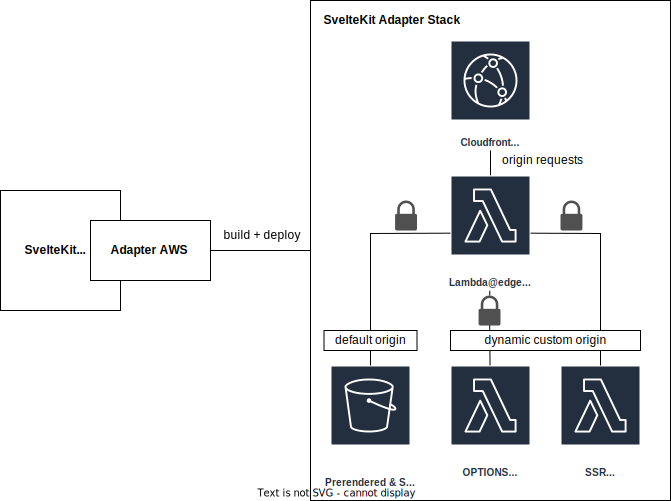

[](https://www.npmjs.com/package/sveltekit-adapter-aws-pulumi)


[](https://github.com/Data-Only-Greater/sveltekit-adapter-aws-pulumi/actions/workflows/unit_tests.yml)
[](https://github.com/Data-Only-Greater/sveltekit-adapter-aws-pulumi/actions/workflows/release.yml)

[](https://app.codecov.io/github/Data-Only-Greater/sveltekit-adapter-aws-pulumi)

# SvelteKit AWS Adapter for Pulumi

This project contains a SvelteKit adapter to deploy SvelteKit to AWS using
Pulumi.

## How to use?

### Setup

1. Create a SvelteKit project "my-app" - `npm create svelte@latest my-app`
1. `cd my-app`
1. `npm install`
1. `npm install -D sveltekit-adapter-aws-pulumi`
1. Edit **svelte.config.js** (see below)
1. Set the following environment variables:
   - PULUMI_ACCESS_TOKEN
   - AWS_ACCESS_KEY_ID
   - AWS_SECRET_ACCESS_KEY

### Build

1. `npm run build`

### Destroy

1. `npx adapter-stack-destroy`

## Basic setup example

**svelte.config.js**

```javascript
import { adapter } from 'sveltekit-adapter-aws-pulumi'
import preprocess from 'svelte-preprocess'

/** @type {import('@sveltejs/kit').Config} */
const config = {
  preprocess: preprocess(),
  kit: {
    // adapter-auto only supports some environments, see https://kit.svelte.dev/docs/adapter-auto for a list.
    // If your environment is not supported or you settled on a specific environment, switch out the adapter.
    // See https://kit.svelte.dev/docs/adapters for more information about adapters.
    adapter: adapter({
      autoDeploy: true,
    }),
  },
}

export default config
```

## Architecture

The following diagram shows the architecture deployed by this package. The key
features are as follows:

1. A CloudFront CDN
1. An S3 bucket to serve prerendered and static content (secured using OAC)
1. Two lambda functions with URL access (secured with AWS_IAM authentication):
   1. A lambda that serves the SSR code
   2. A lambda for OPTIONS requests used to manage preflight CORS
1. A lambda@edge router that will:
   1. Serve static content from the S3 bucket as the cloudfront default origin
   2. Rewrite the cloudfront origin for requests which require SSR or use the
      OPTIONS method and sign them.



## Configuration

```typescript
export interface AWSAdapterProps {
  artifactPath?: string // Build output directory (default: build)
  autoDeploy?: boolean // Should automatically deploy in SvelteKit build step (default: false)
  defaultHeaders?: string[] // Default whitelist of headers for the SSR server. (default: ['Accept','Accept-Language','If-None-Match','Host','Origin','Referer','X-Forwarded-Host'])
  extraHeaders?: string[] // Additional headers to add to whitelist. (default: [])
  esbuildOptions?: any // Override or extend default esbuild options for the SSR server. Supports `external` (default `['node:*']`), `format` (default `cjs`), `target` (default `node18`), `banner` (default `{}`).
  FQDN?: string // Full qualified domain name of CloudFront deployment (e.g. demo.example.com)
  memorySize?: number // Memory size of SSR lambda in MB (default: 128)
  pulumiPaths: string[] // For internal use only
  region?: string // Region to deploy resources (default: us-east-2)
  serverStreaming?: boolean // Use lambda streaming responses for SSR server (default: false)
  stackName?: string // Pulumi stack name (default: dev)
}
```

## Server Environment Variables

Variables can be included in the environment of the SSR server by defining them
in a `.env` file. For example:

```.env
AUTH_SECRET=
AUTH_TRUST_HOST=
```

Values can be added to the `.env` file or defined as environment
variables. If environment variables are defined they will overwrite the values
in the .env file.

## Destroy Command

A script is provided to destroy the infrastructure, with the following
signature:

```
adapter-stack-destroy [artifactPath]

Destroy the SvelteKit adapter's Pulumi stacks

Positionals:
  artifactPath  directory containing the build artifacts. Defaults to 'build'
                                                                        [string]

Options:
      --version           Show version number                          [boolean]
  -s                      stack name                                    [string]
      --default-projects  use the built-in Pulumi projects             [boolean]
  -f, --force             cancel ongoing stack updates                 [boolean]
  -h, --help              Show help                                    [boolean]
```

When running locally, `adapter-stack-destroy` can be called with no arguments
and it will remove the Pulumi stacks based on a config file in the `build`
directory. If an alternative artifact path was used, pass this value to the
script.

When running in a stateless environment, such as CI, passing the option `-s`
with a stack name and `--default-projects` will delete the given stack based
on the projects defined within the package.

## Dependencies

This package utilises the [SvelteKit AWS Adapter Base
Package](https://github.com/Data-Only-Greater/sveltekit-adapter-aws-base) to
prepare the files to be deployed. The project is seeking collaborators to
develop alternative IAC solutions. Please open an issue in the project if you
are interested in collaborating.

## Credits

This package is derived from [Mike Bild's](https://github.com/MikeBild/sveltekit-adapter-aws) adapter for CDK and
inspired by [James Bray's](https://github.com/yarbsemaj/sveltekit-adapter-lambda) adapter for Serverless
Framework.
