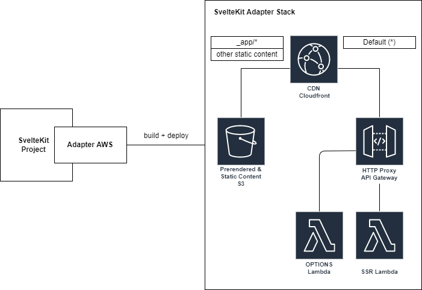

# SvelteKit AWS Adapter for Pulumi

This project contains a SvelteKit adapter to deploy SvelteKit to AWS using Pulumi.

## How to use?

1. Create a SvelteKit project "my-app" - `npm create svelte@latest my-app`
2. `cd my-app`
3. `npm install`
4. `npm install -D sveltekit-adapter-aws-pulumi`
5. edit **svelte.config.js**

## Basic setup example

**svelte.config.js**

```javascript
import { adapter } from 'sveltekit-adapter-aws-pulumi';
import preprocess from 'svelte-preprocess';

export default {
  preprocess: preprocess(),
  kit: {
    adapter: adapter({
      autoDeploy: true,
    }),
  },
};
```

## Architecture

The following diagram shows the architecture deployed by this package. The key features are as follows:

1. A CloudFront CDN
1. An S3 bucket to serve prerendered and static content (via the CloudFront
   CDN)
1. An APIGateWay HTTP API with two routes:
   1. The default route is integrated with a lambda that serves the SSR code
   2. A second route for OPTIONS requests that integrates with a lambda used
      to manage CORS



## Configuration

```typescript
export interface AWSAdapterProps {
  artifactPath?: string; // Build output directory (default: build)
  autoDeploy?: boolean; // Should automatically deploy in SvelteKit build step (default: false)
  pulumiPath?: string; // Path to Pulumi project for custom deployments (e.g. ${process.cwd()}/pulumi)
  stackName?: string; // Pulumi stack name (default: sveltekit-adapter-aws)
  serverHeaders?: string[]; // Whitelist of headers for the SSR server. Defaults to ['Accept','Accept-Charset','Access-Control-Request-Method','Access-Control-Request-Headers','Accept-Datetime','Accept-Language','Origin','Referer']
  staticHeaders?: string[]; // Whitelist of headers for the static files. Defaults to ['User-Agent', 'Referer']
  esbuildOptions?: any; // Override or extend default esbuild options. Supports `external` (default `['node:*']`), `format` (default `cjs`), `target` (default `node16`), `banner` (default `{}`).
  FQDN?: string; // Full qualified domain name of CloudFront deployment (e.g. demo.example.com)
  MEMORY_SIZE?: number; // Memory size of SSR lambda in MB (default 128 MB)
  zoneName?: string; // The name of the hosted zone in Route 53 (defaults to the TLD from the FQDN)
}
```

## Dependencies

This package utilises the [SvelteKit AWS Adapter Base
Package](https://github.com/Data-Only-Greater/sveltekit-adapter-aws-base) to
prepare the files to be deployed.

## Credits

This package is derived from [Mike
Bild's](https://github.com/MikeBild/sveltekit-adapter-aws) AWS adapter for CDK.
